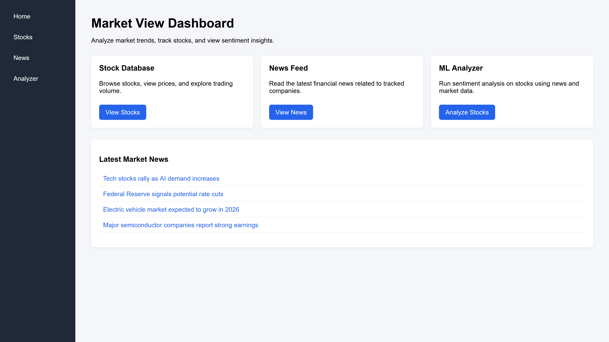
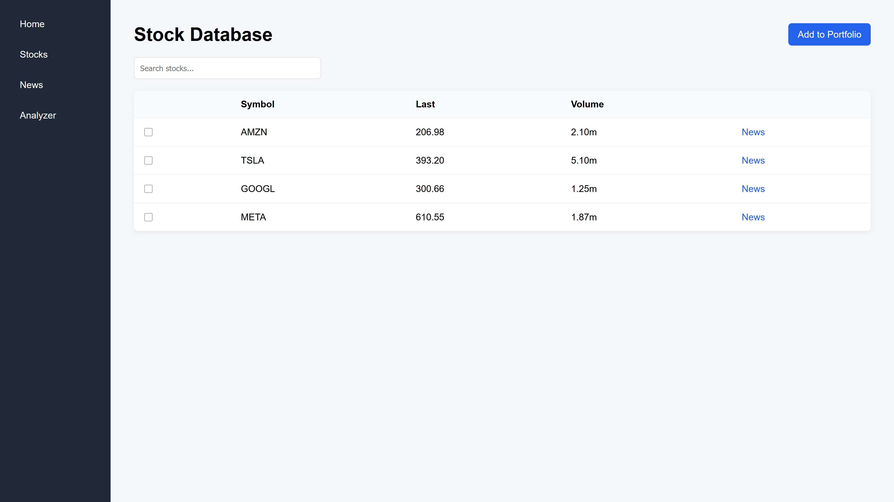

# MarketView
 SYST30025 (Software Engineering)
 Pages
---
## Home Page


## Stocks Page


## Analyzer

## ✅ Prerequisites

- **Node.js** v18+ (includes npm)
- A terminal/command prompt

---

## 🧩 Repository Structure

- `backend/` – Express server (news API proxy)
- `frontend/` – Vite + React UI
- `Pages/` – Static HTML pages (legacy/experimental)
- `machine-learning/` – Python notebook/scripts (separate ML work)

---

## 🚀 Setup (Install Dependencies)

### 1) Backend

```bash
cd backend
npm install
```

> The backend uses `dotenv` and expects a `NEWS_API_KEY` environment variable (for Finnhub).

### 2) Frontend

```bash
cd frontend
npm install
```

---

## 🏃‍♂️ Running the Project

### Run the backend server

From `backend/`:

```bash
npm run dev
```

This starts the Express API on **http://localhost:3000**.

#### Example backend endpoint

- `GET http://localhost:3000/test-news?ticker=AAPL`

Returns JSON with the latest news for a ticker (using Finnhub).

---

### Run the frontend dev server

From `frontend/`:

```bash
npm run dev
```

Vite will start the frontend on **http://localhost:5173** by default.

> If you want the frontend to call the backend, point your API requests to `http://localhost:3000`.

---

## 🛠 Environment Variables (Backend)

Create a `.env` file in `backend/` (it already exists in this repo) with:

```env
NEWS_API_KEY=your_finnhub_api_key_here
```

If you don’t have a Finnhub key, sign up at https://finnhub.io/ and generate one.


(required for using routes that  perform analysis)

---
